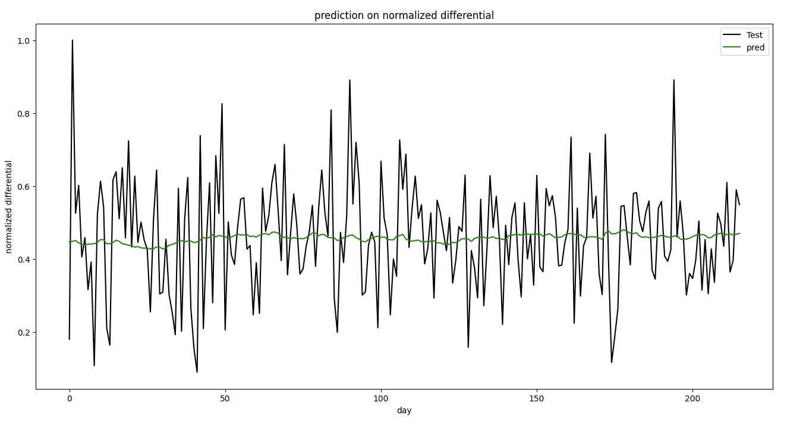

Certainly! Here's an updated version of the comprehensive README using Markdown with headings and formatting:

# Time Series Analysis/Prediction with Keras (training wheels)

## Overview
This code performs time series analysis and prediction using Keras, a high-level neural networks API. The code utilizes historical stock data from the 'GOOGL' ticker symbol obtained through the Yahoo Finance API. The goal is to predict the next day's stock price movement.

## Dependencies
The code requires the following dependencies:
- tensorflow
- keras
- yfinance
- pandas
- numpy
- matplotlib
- pandas_ta
- sklearn

You may need to install the 'pandas_ta' package using the command `! pip install pandas_ta` in the code.

## Data Preparation
1. The code fetches historical stock data for the 'GOOGL' ticker symbol using the Yahoo Finance API. The data is fetched for the period from '2018-01-01' to '2023-01-01'.
2. Various technical indicators are calculated and added to the data, including:
   - RSI (Relative Strength Index) with a length of 15
   - EMA (Exponential Moving Average) with lengths of 20, 100, and 150
   - Other technical indicators can be added as needed
3. The target variable is calculated as the difference between the adjusted closing price ('Adj Close') and the opening price ('Open') of each day. The target variable is then shifted by one day to align it with the corresponding input data.
4. The target variable is transformed into a binary class variable, where 1 represents a positive target (price increase) and 0 represents a negative target (price decrease or no change).
5. The 'Adj Close' of the next day is stored as a separate target variable 'TargetNextClose' for evaluation purposes.
6. Any rows with missing values (NaN) are dropped from the dataset.
7. The 'Volume', 'Close', and 'Date' columns are dropped from the dataset.
8. The remaining dataset is scaled using the MinMaxScaler to normalize the values between 0 and 1.

## Model Training and Testing
1. The input data 'X' is prepared by sliding a window of 'backcandles' (30) previous days' data over the dataset. This creates a 3D array where the first dimension represents the number of samples, the second dimension represents the time steps (backcandles), and the third dimension represents the features (8 technical indicators).
2. The target variable 'y' is reshaped into a 2D array.
3. The data is split into training and testing sets using an 80:20 ratio. The split threshold is calculated based on the length of 'X'.
4. The hyperparameters for the LSTM (Long Short-Term Memory) model are defined:
   - lstm_size: The number of LSTM units in the first layer (150)
   - batch_size: The number of samples per gradient update during training (15)
   - epochs: The number of times the entire dataset is passed forward and backward through the model during training (30)
5. The LSTM model is defined using the Keras functional API. It consists of an LSTM layer followed by a Dense layer and an output Activation layer.
6. The Adam optimizer is used with mean squared error (MSE) loss for compilation of the model.
7. The model is trained using the training data. Validation split of 0.1 is used to evaluate the model performance during training.
8. The trained model is used to make predictions on the test data 'X_test'.
9. The predicted values 'y_pred' are plotted against the actual values 'y_test' using matplotlib.

## Results and Importance of Single Day Differential
The code trains the model using the single day differential as the target variable rather than the total stock price. This choice carries several implications:

- The single day differential represents the change in price from the previous day, which provides a more focused and actionable signal for trading decisions.
- By tracking the differential, the model captures relative changes in price, enabling traders to assess the direction and magnitude of price movements.
- The focus on changes rather than absolute values helps the model capture patterns related to momentum, volatility, and other short-term factors that influence stock prices.
- In real-life trading scenarios, short-term fluctuations and recent trends play a crucial role, making the single day differential more applicable and actionable.

####Adjusting the Number of Candles
The code utilizes a sliding window approach to create input sequences of 'backcandles' (30) previous days' data. Adjusting the number of candles has implications for the range of predictions made by the model:

- A larger number of candles (longer input sequence) provides the model with a more extensive historical context. This can be beneficial for making longer-term predictions, as the model has access to a larger set of data to "remember" and capture longer-term trends.
- However, increasing the number of candles may introduce more noise or irrelevant information, especially if the stock's price dynamics are influenced by shorter-term factors.
- On the other hand, a smaller number of candles (shorter input sequence) focuses the model's attention on more recent data, emphasizing short-term trends and fluctuations.
- Finding the optimal number of candles depends on the specific characteristics of the stock and the desired prediction horizon. It requires experimenting with different window sizes and evaluating the model's performance for various prediction tasks and timeframes.

#### Result: 

Overall, by tracking the single day differential and adjusting the number of candles, the model can generate predictions that are more applicable to real-life trading scenarios. However, continuous evaluation and refinement of the model's performance are necessary to ensure its effectiveness in capturing meaningful patterns and generating accurate predictions. 