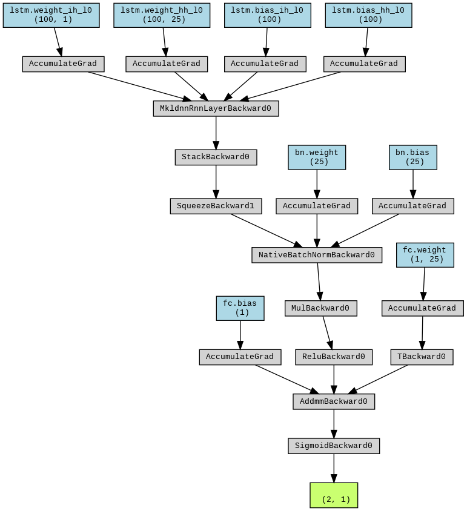

# Predicting Direction of Input Stock from Sequence of n Prior Days. LSTM with Rolling Window Approach 
<p style="text-align: center;">Gordon Doore </p>
<p style="text-align: center;">Colby College '25 </p>
<p style="text-align: center;">Summer 2023 Independent Project </p>

# Project Overview


## Table of Contents

1. [Description](#description)
2. [Dependencies](#dependencies)
3. [Installation](#installation)
4. [Usage](#usage)
5. [Contributing](#contributing)
6. [License](#license)

## Description<a name="description"></a>

### Data Generation:

#### generate_labels.py

1. Load data from the CSV file:
   - The `all_data` variable is assigned the value of the data loaded from the CSV file using `pd.read_csv()`.
   - This `all_data` DataFrame contains the 'Adjusted Close' prices of all of the stocks.

2. Calculate simple returns and cross-sectional medians:
   - `create_simple_returns()` function is called, passing `all_data` and the list of tickers.
   - The function computes the simple returns for each stock and calculates the cross-sectional median return for each day for the entire S&P 500.
   - The result is assigned to `with_simple_returns` DataFrame, which contains the simple returns and cross-sectional medians across the entire dataset.

3. Generate study periods and labels:
   - `create_study_periods()` function is called, passing `with_simple_returns` and other parameters such as study period length, sequence length, stride, and the option to include the median.
   - The function generates study periods, labels, cross-sectional medians, and actual returns.
   - The study periods are assigned to the `study_periods` list, the labels to the `labels` list, the cross-sectional medians to the `crossec_meds` list, and the actual returns to the `trues` list.

4. Reshape the arrays:
   - `reshape_arrays()` function is called, passing `study_periods`, `labels`, and `crossec_meds` lists.
   - The function reshapes the study periods, labels, and cross-sectional medians arrays into the required format for training a machine learning model.
   - The reshaped study periods are assigned to the `study_periods_array`, the reshaped labels to the `labels_array`, and the reshaped cross-sectional medians to the `medians_array`.

5. Print the shapes of the arrays:
   - The shapes of the `study_periods_array`, `labels_array`, and `medians_array` are printed using `print()` statements.

6. Save the reshaped arrays to disk:
   - `save_data()` function is called, passing the `study_periods_array` and `labels_array`.
   - The function saves the study periods and labels arrays to numpy files.

The operations here are very memory intensive and can be extremely slow if your machine has limited memory.

#### Data processing from model:

Here, we do a final reshaping: 
```python
# Now we get our data as an array
y = np.load("/content/sp500-simple-return-labels.npy", mmap_mode='r')
y = y.reshape(-1,)
X = np.load("/content/sp500-simple-return-periodized.npy", mmap_mode='r')
```

We split as 80% train, 10% validation, 10% test.
because we have ~ 8 million samples, we can use this breakdown because the test set will still be non-trivial in size and distinction from the training data.

```python
#now we split our data
# Calculate the number of samples for each split
num_samples = len(X)
num_train = int(0.8 * num_samples)
num_val = int(0.1 * num_train)

#and split
X_train = X[:num_train]
y_train = y[:num_train]
X_val = X[num_train:num_train+num_val]
y_val = y[num_train:num_train+num_val]
X_test = X[num_train+num_val:]
y_test = y[num_train+num_val:]
```

##### Data Loader:
our model is looking for our data to come batched, so we use PyTorch's DataLoader object

we define our loaders as follows: 

```python
train_dataset = TensorDataset(torch.from_numpy(X_train).float(), torch.from_numpy(y_train).float().unsqueeze(1))
train_loader = DataLoader(train_dataset, batch_size=128, shuffle=True)

val_dataset = TensorDataset(torch.from_numpy(X_val).float(), torch.from_numpy(y_val).float().unsqueeze(1))
val_loader = DataLoader(val_dataset, batch_size=128, shuffle=False)

test_dataset = TensorDataset(torch.from_numpy(X_test).float(), torch.from_numpy(y_test).float().unsqueeze(1))
test_loader = DataLoader(test_dataset, batch_size=128, shuffle=False)
```

Here we can modify the batch size,and this is still being experimented on.
I shuffled the training data to ensure against overtraining (sliding window has highly similar data next to eachother)
The data is then unsqueezed to be accepted into the model's criterion (BCELoss)

The data is now acceptable for entry into the model.

### Model Architecture:

##### Diagram represents flow of data with batch_size = 2 
###### In reality, I have been using between 32 and 128


Our model has the input layer which then moves into the LSTM layer.  Next, the output of the LSTM is normalized using batch normalization.  In this case, we have our batchsize set to 2. The output of this normalization then has 10% dropout performed to avoid overfitting and a ReLU afterward to help reduce linearity in the data to help the model learn better. Next, the output of ReLU is entered into a fully connected layer of hidden size 1, thus reducing the dimensionality of the output to our binary classification. Finally, this is activated with sigmoid, which is the best output activation for binary classification problems.

Here is the model class: 

```python
class LSTMNetwork(nn.Module):
    def __init__(self, input_size, hidden_size):
        super(LSTMNetwork, self).__init__()
        self.hidden_size = hidden_size
        self.lstm = nn.LSTM(input_size, hidden_size, batch_first=True)
        self.relu = nn.ReLU()
        self.dropout = nn.Dropout(0.1)
        self.fc = nn.Linear(hidden_size, 1)  # Set output_size to 1 for binary classification in single channel
        self.sigmoid = nn.Sigmoid()
        self.bn = nn.BatchNorm1d(hidden_size)

    def forward(self, x):
        # x shape: (batch_size, seq_length, input_size)
        _, (h_n, _) = self.lstm(x)
        # h_n shape: (1, batch_size, hidden_size)
        h_n = h_n.squeeze(0)
        # h_n shape: (batch_size, hidden_size)
        out= self.bn(h_n) #batch normalize
        out = self.dropout(out) #dropout
        out = self.relu(out) #ReLU
        out = self.fc(out) #fully connected
        out = self.sigmoid(out) #out
        return out
```

### Model Training Loop:

The train() function trains the model by iterating over epochs, performing forward and backward passes for each batch, calculating training and validation losses, and updating the model's parameters using an optimizer. It implements early stopping based on the validation loss and returns the state dictionary of the model with the best validation loss.

I use Binary Cross Entropy Loss as our criterion and an RMSprop optimizer.  This follows Krauss and Fischer, 2018.

The rest of the training hyperparameters are still in progress and we do not have an effective combination of parameters.

Here's the training loop

```python
def train(model, train_loader, val_loader, max_epochs=100, patience=5, lr=0.001):
    device = torch.device('cuda' if torch.cuda.is_available() else "cpu")
    model = model.to(device)

    # Loss and optimizer
    criterion = nn.BCELoss()
    optimizer = optim.RMSprop(model.parameters(), lr=lr)

    # Initialize variables for Early Stopping
    patience_counter = 0
    best_val_loss = None
    best_model = None

    for epoch in range(max_epochs):
        model.train()
        running_loss = 0.0
        for i, (inputs, labels) in enumerate(train_loader):
            inputs = inputs.to(device)
            labels = labels.to(device)

            # Zero the parameter gradients
            optimizer.zero_grad()

            # Forward + backward + optimize
            outputs = model(inputs)
            loss = criterion(outputs, labels)
            loss.backward()
            optimizer.step()

            running_loss += loss.item()

        # Print average training loss over epoch
        avg_train_loss = running_loss / len(train_loader)

        model.eval()
        running_val_loss = 0.0
        with torch.no_grad():
            for inputs_val, labels_val in val_loader:
                inputs_val = inputs_val.to(device)
                labels_val = labels_val.to(device)

                outputs_val = model(inputs_val)
                loss_val = criterion(outputs_val, labels_val)
                running_val_loss += loss_val.item()

        # Print average validation loss over epoch
        avg_val_loss = running_val_loss / len(val_loader)
        print('Epoch [{}/{}], Train Loss: {:.4f}, Val Loss: {:.4f}'.format(
            epoch+1, max_epochs, avg_train_loss, avg_val_loss))

        # Early Stopping and save the best model
        if best_val_loss is None or avg_val_loss < best_val_loss:
            best_val_loss = avg_val_loss
            best_model = copy.deepcopy(model.state_dict())
            patience_counter = 0
        else:
            patience_counter += 1
            print(f'EarlyStopping counter: {patience_counter} out of {patience}')
            if patience_counter >= patience:
                print('Early stopping')
                break

    model.load_state_dict(best_model)
    return model.state_dict()
```

### Testing: 

In progress


## Dependencies<a name="dependencies"></a>

The project has the following dependencies:

- [Dependency 1](link): [Brief description or purpose of the dependency].
- [Dependency 2](link): [Brief description or purpose of the dependency].
- [Dependency 3](link): [Brief description or purpose of the dependency].
- ...

Please make sure to install or set up these dependencies before using the project.

## Installation<a name="installation"></a>

To install the project, follow these steps:

1. Clone the repository: `git clone <repository_url>`
2. Navigate to the project directory: `cd project_directory`
3. Install the required dependencies: `npm install` or `pip install -r requirements.txt`

## Usage<a name="usage"></a>

To use the project, follow these steps:

1. [Provide step-by-step instructions on how to use the project]
2. [Include examples or code snippets if necessary]

## Contributing<a name="contributing"></a>

Contributions to this project are welcome. To contribute, please follow these steps:

1. Fork the repository
2. Create a new branch: `git checkout -b new_branch`
3. Make your changes and commit them: `git commit -am 'Add feature'`
4. Push the changes to your forked repository: `git push origin new_branch`
5. Submit a pull request detailing your changes

## License<a name="license"></a>

[Specify the license under which the project is distributed. For example, MIT, Apache, etc.]

Please refer to the LICENSE file for more information.

Feel free to reach out if you have any questions or need further assistance.

Happy coding!

